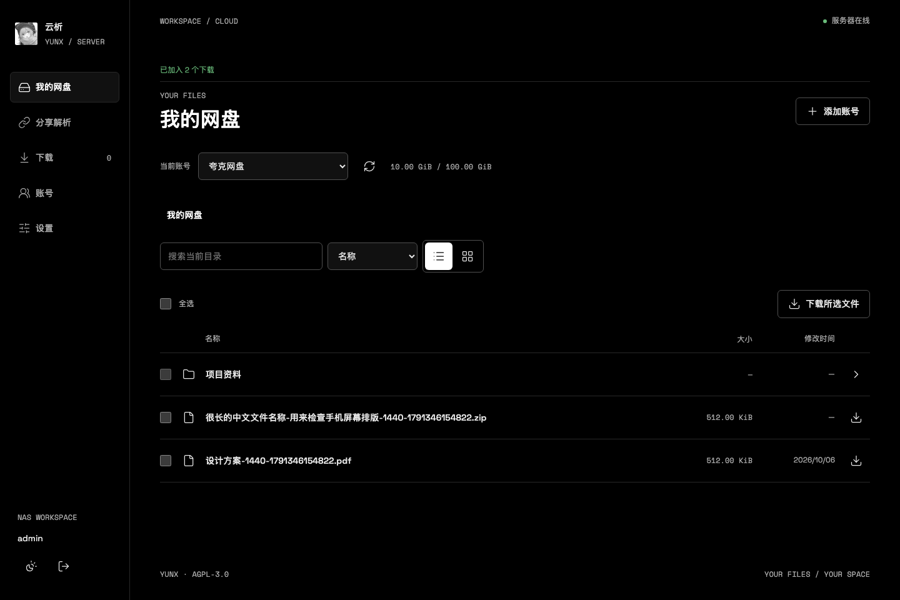
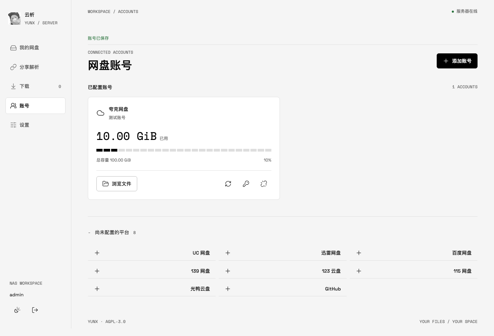
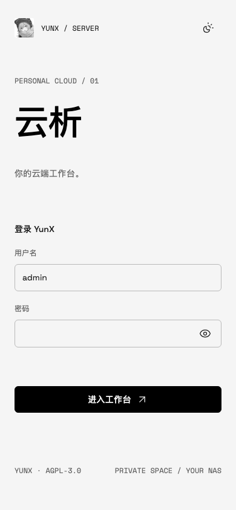

<div align="center">


# 云析 · Docker 网页版

基于 [tidain/YunX-Desktop](https://github.com/tidain/YunX-Desktop) 的 Fork 二次开发，
复用其网盘解析与下载核心，增加可部署在 NAS / Linux 服务器上的 Docker 网页工作台。

[Docker Hub](https://hub.docker.com/r/muzileee/yunx-server) ·
[本仓库发布页](https://github.com/mu-zi-lee/YunX-Desktop/releases) ·
[NAS 部署](#nas-部署) ·
[Web 与 Windows 功能对照](docs/WEB-FEATURES.md)

</div>

> 这是 **Docker 网页版** 的仓库首页。Windows 桌面版由上游 [tidain/YunX-Desktop](https://github.com/tidain/YunX-Desktop)
> 开发；更早的 Android 项目为 [CYQawa/YunX](https://github.com/CYQawa/YunX)。
> 本 Fork 保留桌面版源码与文档，并在独立的 `server/` 模块实现网页服务。

## 界面预览

下方账号、容量与文件内容是浏览器测试使用的**演示数据**，不是实际网盘账号的容量或真实下载结果。



<table>
  <tr>
    <td width="73%"></td>
    <td width="27%"></td>
  </tr>
  <tr>
    <td align="center">账号与容量 · 桌面浏览器</td>
    <td align="center">登录 · 手机浏览器</td>
  </tr>
</table>

## Docker 版能做什么

- **个人网盘**：浏览夸克、UC、百度、139、115、123、光鸭与迅雷的目录，支持面包屑、当前目录搜索、排序、列表/网格和逐文件多选下载。迅雷个人目录需要 App 通道凭证。
- **分享解析**：解析支持平台的分享链接，浏览目录并加入下载；另支持 GitHub 仓库、账号及直链。可收藏链接并查看最近解析记录。
- **账号管理**：在网页中手动添加 Cookie / Token，已配置账号和未配置平台分开显示；可查询接口提供的昵称与存储空间，用量无法获取时显示未知。凭证加密存储，不在页面回显。
- **服务器下载**：复用分片下载器，支持任务状态、暂停/继续、断点续传和下载限速。关闭浏览器后任务仍在服务器运行，文件写入挂载的下载目录。
- **网页登录**：首次启动生成随机密码，提供登录、退出和修改密码；下载线程、并发数与限速可在设置页保存。支持浅色、黑色及跟随系统主题。

**功能边界：** 网页版采用手动填写网盘凭证，尚无 Windows 版的内嵌浏览器、扫码/短信登录、浏览器 Cookie 导入、系统托盘、剪贴板监听、整文件夹下载和云端文件改名/删除等功能。
完整差异见 [Web 与 Windows 功能对照](docs/WEB-FEATURES.md)。网盘接口可能随平台变化；保存凭证不表示已经验证账号有效。

## NAS 部署

在 NAS 的容器管理器中创建 Compose 项目，使用 [docker-compose.nas.yml](docker-compose.nas.yml)。
在**项目所在目录**创建 `data` 和 `downloads` 两个专用文件夹，并授予运行容器的 UID/GID（默认 `1000:1000`）写入权限。
默认镜像是 Docker Hub 的 `muzileee/yunx-server:latest`，支持 Linux amd64 / arm64。

| NAS 项目目录 | 容器路径 | 内容 |
| --- | --- | --- |
| `./data` | `/data` | 登录密码、网盘凭证及密钥、数据库、任务与缓存 |
| `./downloads` | `/downloads` | 下载的文件和续传所需文件 |

项目启动后，浏览器打开 `http://NAS的IP:8080`，用户名默认 `admin`。
若 `YUNX_PASSWORD` 留空，首次密码在容器终端执行以下命令读取：

```sh
cat /data/initial-password.txt
```

登录后可在“设置 → 登录与安全”修改密码；修改后初始密码文件会删除。若显式设置了非空 `YUNX_PASSWORD`，密码由部署配置管理，网页不能修改。
请保留并备份整个 `data` 和 `downloads` 目录，不要只备份数据库；加密密钥也保存在 `data` 中。

通过 SSH 部署到新建的项目目录：

```sh
git clone https://github.com/mu-zi-lee/YunX-Desktop.git
cd YunX-Desktop
mkdir -p data downloads
sudo chown 1000:1000 data downloads
docker compose -f docker-compose.nas.yml up -d
docker compose -f docker-compose.nas.yml exec -T yunx cat /data/initial-password.txt
```

上面的 `chown` 仅适用于新建的专用目录；已有 NAS 共享目录可用 ACL 授予容器用户写入权限。
仓库根目录的 [compose.yaml](compose.yaml) 使用 **Docker 命名卷**保存 `/data`，适合常规服务器部署；需要数据都落在所选项目目录时，请使用 NAS 配置。

## 更新与配置

备份数据目录后，在 NAS 界面重新拉取镜像并重建项目，保留原挂载目录；原有登录密码、账号和任务会继续使用。
SSH 部署可执行：

```sh
docker compose -f docker-compose.nas.yml pull
docker compose -f docker-compose.nas.yml up -d
```

如需固定版本，将 `YUNX_IMAGE` 设为 `muzileee/yunx-server:0.2.0`；默认使用 `latest`。
可通过 Compose 环境变量设置端口、用户名、密码和下载参数，完整说明见 [Docker 部署文档](docs/DOCKER.md)。
需要从公网访问时，请使用 HTTPS 反向代理保护登录信息和网盘凭证。

## 与上游的关系

| 项目 | 主要内容 |
| --- | --- |
| [CYQawa/YunX](https://github.com/CYQawa/YunX) | 最初的 Android 项目 |
| [tidain/YunX-Desktop](https://github.com/tidain/YunX-Desktop) | Windows 桌面移植、网盘 API、分享解析与下载器 |
| 本仓库 `mu-zi-lee/YunX-Desktop` | 基于 Windows 版 Fork 的 Docker 服务端、网页登录、NAS 部署和双架构镜像发布 |

Windows 应用本身仍在仓库的 `desktop/` 目录中；Windows 的使用方式、功能与构建分别见
[使用说明](docs/USAGE.md)、[桌面功能清单](docs/FEATURES.md) 和 [构建说明](docs/BUILD.md)。
需要上游的 Windows 安装包，请前往 [原桌面版发布页](https://github.com/tidain/YunX-Desktop/releases)。

## 开发与验证

`server/` 是独立的 Gradle 服务模块，复用 `desktop/` 中不依赖图形界面的网盘协议、数据库和下载代码。
常规推送由 GitHub Actions 分别在 amd64、arm64 上构建并运行容器测试；发布 `server-v*` 标签时，在测试通过后推送多架构镜像到 Docker Hub。
本地测试及构建方式见 [Docker 部署文档](docs/DOCKER.md#本地开发与验证)。
浏览器测试使用模拟网盘响应和本地 HTTP 下载源；真实网盘容量、平台风控以及具体 NAS 设备需要使用实际账号进一步验证。

## 开源协议

本项目沿用上游的 [GNU AGPL-3.0](LICENSE) 协议，保留原作者署名。
本 Fork 完全免费开源；平台兼容性及使用边界见 [免责声明](docs/DISCLAIMER.md)。
