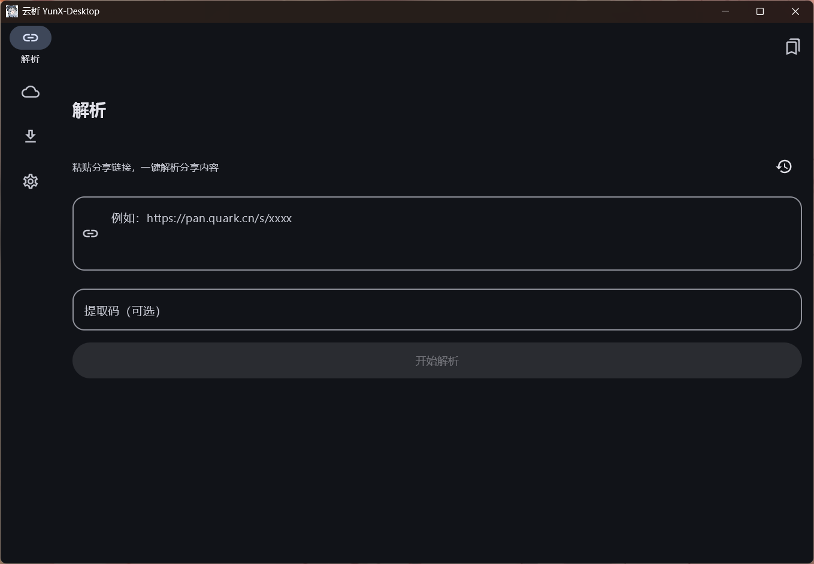
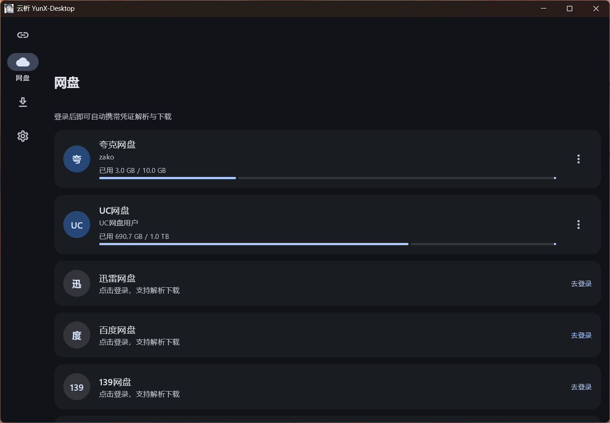
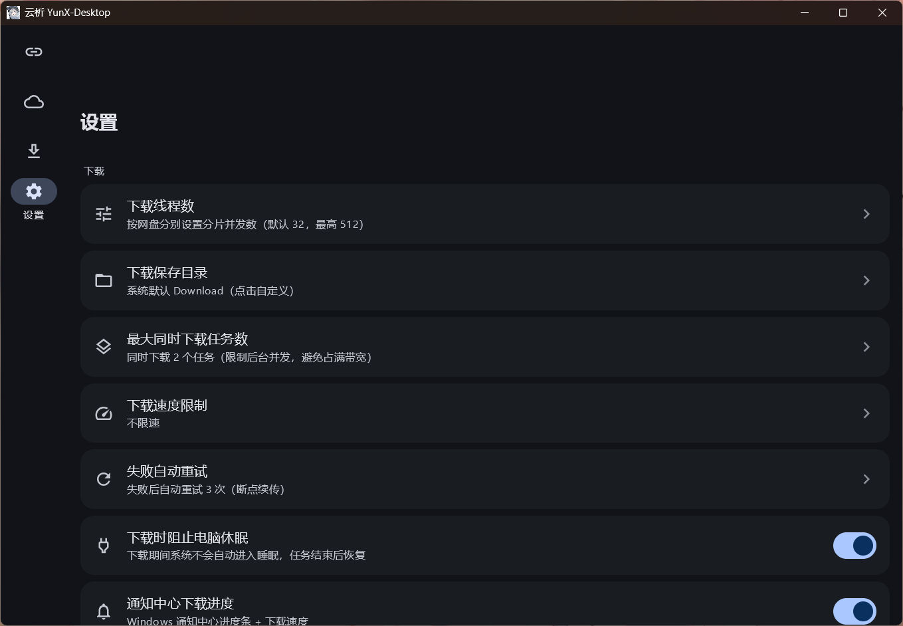
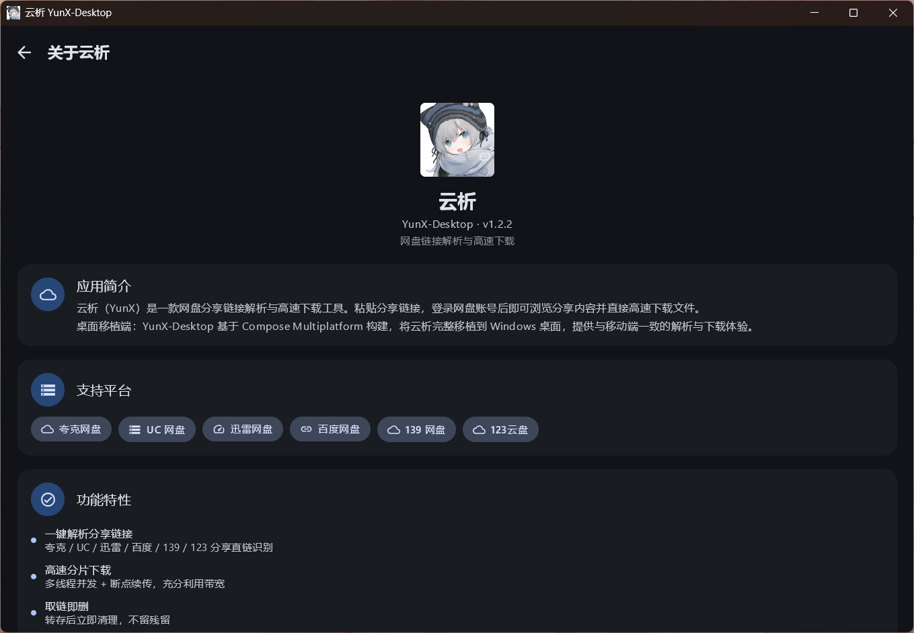

<div align="center">


# 云析桌面版 · YunX-Desktop

**粘贴分享链接，直接高速下载 —— 云析 YunX 的 Windows 桌面移植**

识别夸克 / UC / 迅雷 / 百度 / 139 / 123 分享链接，自动匹配提取码，Range 分片并发 + 断点续传。

[](https://github.com/tidain/YunX-Desktop/releases/latest)
[](https://github.com/tidain/YunX-Desktop/stargazers)
[](./LICENSE)
[](#构建)
[](https://kotlinlang.org/)
[](https://www.jetbrains.com/lp/compose-multiplatform/)

[下载最新版](https://github.com/tidain/YunX-Desktop/releases/latest) · [功能](docs/FEATURES.md) · [使用](docs/USAGE.md) · [构建](docs/BUILD.md) · [常见问题](#常见问题) · [与上游差异](docs/UPSTREAM-DIFF.md)

</div>

***

> **云析永远免费开源。** 如果你是在任何地方「花钱买到」的，说明你被骗了，请立即退款。
> 任何收费版本均为二次打包的诈骗版本，与本项目无关。

> **本项目使用 AGPL-3.0 开源协议。** 基于上游 [CYQawa/YunX](https://github.com/CYQawa/YunX)（Android）移植，
> 若你使用了本项目的代码，请同样以 AGPL-3.0 开放源代码。

## 简介

云析 YunX 的 **Windows 桌面移植版**：粘贴网盘分享链接，浏览分享内容并直接高速下载文件，全程在电脑上完成。
提供**免安装便携版**（整个文件夹拷走即用）与**安装版**（开始菜单 / 桌面快捷方式，可卸载）两种分发形式。

## 截图

|                                                          |                                                            |
| :------------------------------------------------------: | :--------------------------------------------------------: |
|    |    |
|                           主界面                           |                           网盘登录                           |
|      |      |
|                            设置                            |                            关于                            |

## 支持平台

- 夸克网盘

- UC 网盘

- 迅雷网盘

- 百度网盘

- 139 网盘（和彩云）

- 123 云盘

> \[!WARNING]
> **不建议使用百度网盘，可能导致账号被风控！**

## 功能

- **分享链接解析** —— 识别 6 家网盘分享链接，自动匹配提取码

- **高速下载** —— Range 分片并发 + 断点续传 + 失败自动重试 + 全局限速

- **通知中心进度** —— 下载进度实时显示为 Windows 通知中心 toast 进度条（多任务聚合 + 实时速度）

- **多种登录方式** —— 内嵌 Chromium 登录 / 一键导入本机浏览器 Cookie / 手动粘贴 Cookie

- **Windows 系统集成** —— 原生托盘菜单（亮暗跟随系统配色）、原生文件对话框、剪贴板分享链接检测

- **桌面体验** —— 深色模式 + 自定义种子色、链接收藏、解析历史、窗口内弹窗覆盖层

完整功能清单见 **[功能清单](docs/FEATURES.md)**。

## 与上游的差异

桌面版在**登录方式、系统集成（托盘 / 通知 / 原生对话框）、数据存储、构建分发**上做了较大改造，
并移除了一部分移动端专属功能。完整清单见 **[与上游的差异](docs/UPSTREAM-DIFF.md)**。

## 技术栈

| 分类    | 选型                                         |
| ----- | ------------------------------------------ |
| 语言    | Kotlin                                     |
| UI    | Compose Multiplatform（Desktop）+ Material 3 |
| 持久化   | `sqlite-jdbc`（SQLite）+ `java.util.prefs`   |
| 网络    | OkHttp 4.12.0（请求 + 分片下载）                   |
| 内嵌浏览器 | JCEF 132（Chromium）                         |
| 原生桥接  | JNA（Win32 API）+ 自编 `darkmode.dll`          |
| 构建分发  | Gradle + jlink + jpackage + Inno Setup     |

## 使用

1. 在「网盘」页登录需要使用的网盘账号（推荐内嵌浏览器登录）
2. 在「解析」页粘贴分享链接（可带提取码，支持从剪贴板一键粘贴）
3. 浏览分享内容，点击文件加入下载
4. 在「下载」页查看进度，支持暂停 / 继续 / 删除 / 打开；进度同步显示在 Windows 通知中心

设置项、数据目录、托盘操作见 **[使用说明](docs/USAGE.md)**。

## 构建

要求：Windows 10/11 x64，另需一个 **C++ 编译器**（托盘菜单配色桥接层用；缺它时 `run` / `package` /
`installer` 会在这一步失败）。JDK、Gradle、Inno Setup 均无需手动安装。

```powershell
git clone https://github.com/tidain/YunX-Desktop.git
cd YunX-Desktop

.\run.ps1 run        # 编译并启动（开发，含 darkmode.dll）
.\run.ps1 build      # 仅编译 Kotlin（不需要 C++ 编译器）
.\run.ps1 package    # 免安装便携版 → release\YunX-Desktop\
.\run.ps1 installer  # 单文件安装程序 → release\YunX-Desktop-setup-*.exe
```

环境要求、版本号管理与打包产物见 **[构建与打包](docs/BUILD.md)**。

## 常见问题

<details>
<summary><b>百度网盘下载 / 转存不了？</b></summary>

账号被风控了，详见上游 issue #9。

</details>

<details>
<summary><b>便携版和安装版有什么区别？</b></summary>

便携版是免安装的文件夹，拷到任意位置双击 `YunX-Desktop.exe` 即可运行；
安装版走安装向导，安装到 `%LOCALAPPDATA%\Programs\YunX-Desktop`，并创建开始菜单 / 桌面快捷方式，可在设置中卸载。
两者功能完全一致。

</details>

<details>
<summary><b>下载时看不到 Windows 通知中心的通知？</b></summary>

先确认「设置 → 系统 → 通知」已开启（专注助手 / 免打扰也会拦通知）。应用在检测到通知未送达时，
会尝试自动创建所需的开始菜单快捷方式兜底，但最终能否弹出仍取决于系统通知设置。

</details>

## 支持开发

- **GitHub Star**：给 [tidain/YunX-Desktop](https://github.com/tidain/YunX-Desktop) 点个 Star ⭐

- **提交 Issues**：发现 Bug 或有功能建议欢迎反馈

- **赞赏**：应用内「支持开发」页面可扫码赞赏原安卓项目作者（CYQawa）与桌面移植作者（tidain）

## 文档

| 文档                              | 内容                             |
| ------------------------------- | ------------------------------ |
| [功能清单](docs/FEATURES.md)        | 全部功能与细节                        |
| [使用说明](docs/USAGE.md)           | 快速上手、登录方式、设置项、数据目录、托盘操作        |
| [构建与打包](docs/BUILD.md)          | 环境要求、命令、版本号、打包产物、目录结构          |
| [与上游的差异](docs/UPSTREAM-DIFF.md) | 桌面版相对上游 Android 版的新增 / 重做 / 移除 |
| [免责声明](docs/DISCLAIMER.md)      | 免责声明、协议逆向说明、反倒卖、开源协议           |

## 开源协议

本项目基于上游 [CYQawa/YunX](https://github.com/CYQawa/YunX) 移植，同样以
[GNU AGPL-3.0](https://www.gnu.org/licenses/agpl-3.0.html) 协议开源，详见 [LICENSE](LICENSE)。
完整的免责与合规说明见 **[免责声明](docs/DISCLAIMER.md)**。

## 更多

- 原安卓项目仓库：<https://github.com/CYQawa/YunX>

- PC 移植版仓库：<https://github.com/tidain/YunX-Desktop>

- 问题与建议：<https://github.com/tidain/YunX-Desktop/issues>

## Star History

<a href="https://www.star-history.com/?repos=tidain%2Fyunx-desktop&type=date&legend=top-left">
 <picture>
   <source media="(prefers-color-scheme: dark)" srcset="https://api.star-history.com/chart?repos=tidain/yunx-desktop&type=date&theme=dark&legend=top-left" />
   <source media="(prefers-color-scheme: light)" srcset="https://api.star-history.com/chart?repos=tidain/yunx-desktop&type=date&legend=top-left" />
   
 </picture>
</a>
